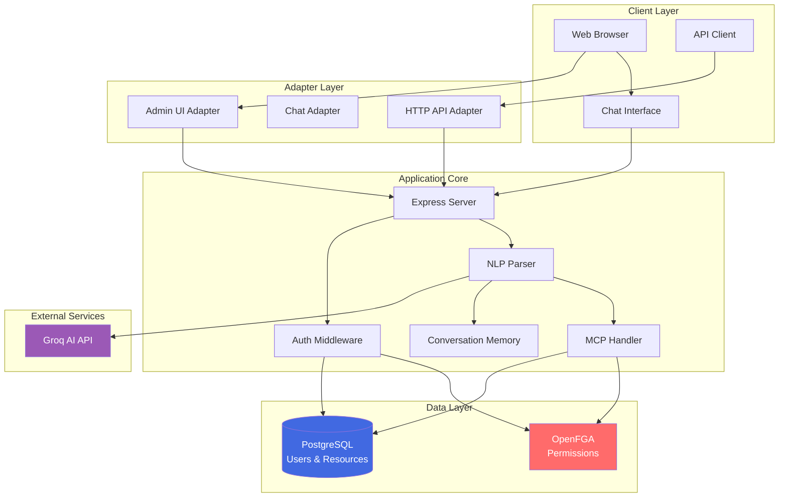
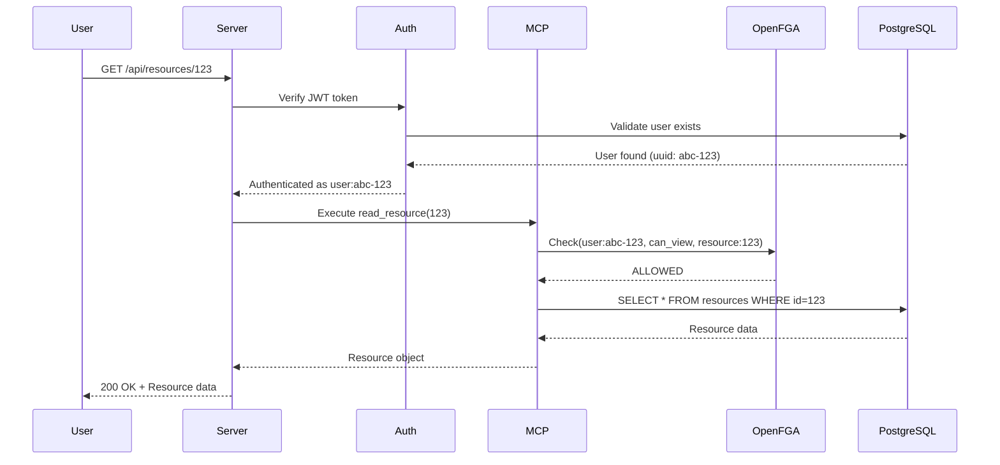
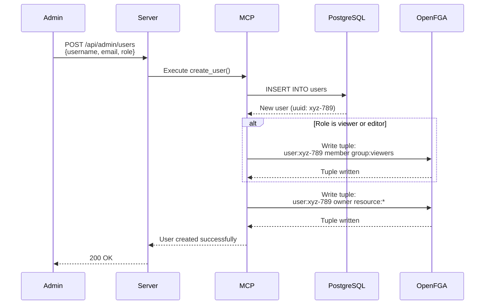
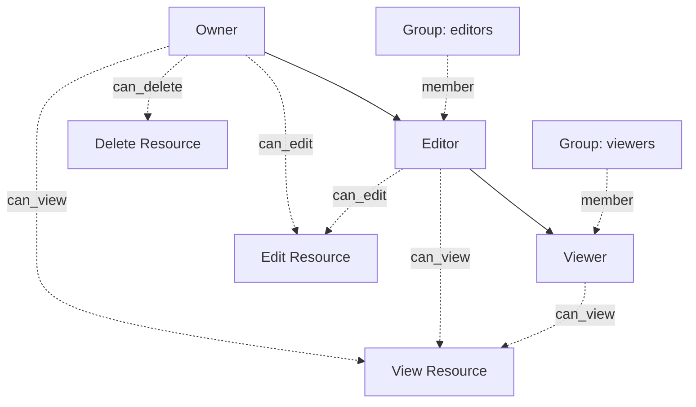
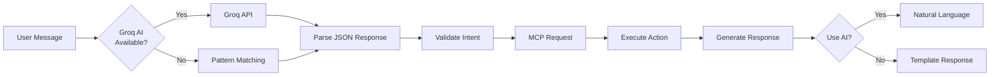

# Architecture Overview: MCP Resource Manager

This project is a secure, intelligent Resource Manager built on three core pillars: **PostgreSQL**, **OpenFGA**, and **AI-powered natural language processing**. 

It demonstrates how to build a modern application where **identity** and **authorization** are completely decoupled from business logic, following the principles of Google's Zanzibar paper.

## Table of Contents

- [Core Components](#core-components)
- [System Architecture](#system-architecture)
- [How It Works Together](#how-it-works-together)
- [Multi-Adapter Architecture](#multi-adapter-architecture)
- [Authorization Model](#authorization-model)
- [AI/NLP Layer](#ainlp-layer)
- [Database Schema](#database-schema)
- [API Endpoints](#api-endpoints)
- [Deployment Architecture](#deployment-architecture)

## Core Components

### 🐘 PostgreSQL (The "Truth")
**Role**: Persistent Storage & Identity Provider

- Stores the *content* of resources (files, appointments, projects)
- Stores the *users* (email, password hash, role metadata)
- **Key Concept**: The database knows *what* exists and *who* exists, but delegates the complex decision of *"who can see what"* to OpenFGA
- **Tables**: `users`, `resources`

**Why PostgreSQL?**
- ACID compliance for data integrity
- UUID support for secure identifiers
- Excellent performance for relational data
- Rich ecosystem and tooling

### 🛡️ OpenFGA (The "Gatekeeper")
**Role**: Fine-Grained Authorization Engine

- Stores *relationships* (Tuples), not data
- **Tuples**: Facts like `user:tharsan` is `owner` of `resource:file_123`
- **Model**: Defines the authorization rules
    - *If you are an `owner` of a file, you can `view` it*
    - *If you are an `editor`, you can `view` and `edit` it*
    - *If you are in the `editors` group, you inherit editor permissions*
- **Why it matters**: Instead of writing complex SQL checks (`WHERE owner_id = ? OR role = 'admin' OR id IN (...)`), the app simply asks OpenFGA: *"Can User X view Resource Y?"* → `TRUE/FALSE`

**Benefits:**
- Centralized authorization logic
- Consistent permission checks across all interfaces
- Scalable to millions of tuples
- Audit trail of all permission changes

### 🤖 AI/NLP Layer (The "Interpreter")
**Role**: Natural Language Understanding

- **Groq AI**: Fast inference for intent parsing
- **Pattern Matching**: Fallback when AI unavailable
- **Conversation Memory**: Context-aware multi-turn dialogues
- **Entity Extraction**: Identifies users, resources, roles from natural language

**Flow:**
1. User sends: *"make alice an admin"*
2. **AI/NLP**: Parses into structured request `{ action: 'change_role', user: 'alice', role: 'admin' }`
3. **MCP Handler**: Executes the request with authorization checks
4. **Response Generator**: Creates natural language response

### 🔧 MCP Handler (The "Orchestrator")
**Role**: Business Logic & Authorization Orchestration

- Acts as the central coordinator between all components
- **Flow**:
    1. Receives structured MCP Request
    2. Validates user permissions via OpenFGA
    3. Executes database operations
    4. Manages OpenFGA tuples
    5. Returns structured response
- **Significance**: Creates a standardized way for all interfaces (API, Chat, Admin UI) to interact with the system securely

## System Architecture



## How It Works Together

### Scenario: User Tries to View a Resource



### Scenario: Admin Creates a New User



## Multi-Adapter Architecture

The system supports three different interfaces, all using the same MCP Handler:

### 1. HTTP API Adapter
- Traditional REST endpoints
- JWT authentication
- JSON request/response
- Direct database queries with OpenFGA checks

### 2. Chat Adapter
- Natural language input
- AI-powered intent parsing
- Conversational responses
- Same authorization as API

### 3. Admin UI Adapter
- Web-based dashboard
- Cookie-based authentication
- Visual feedback
- Same backend as API and Chat

**Key Principle:** All adapters are "dumb" - they only translate between their interface format and MCP requests. All business logic and authorization lives in the MCP Handler.

## Authorization Model

### OpenFGA Model Definition

```
model
  schema 1.1

type user

type group
  relations
    define member: [user]

type resource
  relations
    define owner: [user]
    define editor: [user, group#member] or owner
    define viewer: [user, group#member] or editor or owner
    define can_view: viewer
    define can_edit: editor
    define can_delete: owner
```

### Permission Hierarchy



### Tuple Examples

```javascript
// User alice owns resource:file_123
{ user: "user:alice", relation: "owner", object: "resource:file_123" }

// User bob is a member of the editors group
{ user: "user:bob", relation: "member", object: "group:editors" }

// The editors group has editor access to resource:file_456
{ user: "group:editors#member", relation: "editor", object: "resource:file_456" }
```

## AI/NLP Layer

### Intent Parsing Flow



### Conversation Memory

The system maintains conversation history for context-aware interactions:

```typescript
interface ConversationMessage {
    role: 'user' | 'assistant';
    content: string;
    timestamp: number;
}

// Stores last 10 messages per user
const conversationHistory = new Map<string, ConversationMessage[]>();
```

**Benefits:**
- Multi-turn conversations
- Context retention
- Follow-up questions
- Pronoun resolution

## Database Schema

### Users Table

```sql
CREATE TABLE users (
    uuid UUID PRIMARY KEY DEFAULT gen_random_uuid(),
    username VARCHAR(255) UNIQUE NOT NULL,
    email VARCHAR(255) UNIQUE NOT NULL,
    password_hash VARCHAR(255) NOT NULL,
    role VARCHAR(50) NOT NULL CHECK (role IN ('owner', 'admin', 'editor', 'viewer')),
    created_at TIMESTAMP DEFAULT CURRENT_TIMESTAMP
);

CREATE INDEX idx_users_username ON users(username);
CREATE INDEX idx_users_email ON users(email);
```

### Resources Table

```sql
CREATE TABLE resources (
    id SERIAL PRIMARY KEY,
    name VARCHAR(255) NOT NULL,
    type VARCHAR(100) NOT NULL,
    category VARCHAR(100) NOT NULL,
    owner_id UUID REFERENCES users(uuid) ON DELETE CASCADE,
    created_at TIMESTAMP DEFAULT CURRENT_TIMESTAMP
);

CREATE INDEX idx_resources_owner ON resources(owner_id);
CREATE INDEX idx_resources_category ON resources(category);
```

## API Endpoints

### Authentication
- `POST /api/auth/login` - User login
- `POST /api/auth/register` - User registration
- `POST /api/auth/change-password` - Change password
- `GET /api/auth/me` - Get current user

### User Management (Admin)
- `GET /api/admin/users` - List all users
- `POST /api/admin/users` - Create user
- `PUT /api/admin/users/:userId/role` - Change user role
- `DELETE /api/admin/users/:userId` - Delete user

### Resource Management
- `GET /api/resources` - List accessible resources
- `POST /api/resources` - Create resource
- `GET /api/resources/:id` - Get resource details
- `DELETE /api/resources/:id` - Delete resource

### Chat Interface
- `POST /api/chat` - Send chat message
- `GET /api/chat/history` - Get conversation history

### Permissions
- `GET /api/permissions/resource/:resourceId` - List users with access
- `POST /api/permissions/grant` - Grant access
- `POST /api/permissions/revoke` - Revoke access

## Deployment Architecture

### Development Setup

```
┌─────────────────┐
│   Developer     │
│   Machine       │
├─────────────────┤
│ Node.js App     │
│ PostgreSQL      │
│ OpenFGA         │
└─────────────────┘
```

### Production Setup (Recommended)

```
┌──────────────┐      ┌──────────────┐
│   Load       │      │   Load       │
│   Balancer   │──────│   Balancer   │
└──────┬───────┘      └──────┬───────┘
       │                     │
   ┌───┴────┐           ┌────┴────┐
   │ App    │           │ App     │
   │ Server │           │ Server  │
   │ (Node) │           │ (Node)  │
   └───┬────┘           └────┬────┘
       │                     │
       └──────────┬──────────┘
                  │
       ┌──────────┴──────────┐
       │                     │
   ┌───┴────┐           ┌────┴────┐
   │ PostgreSQL         │ OpenFGA │
   │ (Primary)          │ Cluster │
   │                    │         │
   └────────┘           └─────────┘
```

### Environment Considerations

**Development:**
- Single server setup
- Local PostgreSQL and OpenFGA
- Groq AI optional

**Production:**
- Multiple app servers behind load balancer
- Managed PostgreSQL (e.g., AWS RDS, Azure Database)
- OpenFGA cluster for high availability
- CDN for static assets
- Redis for session storage (optional)

## Security Considerations

### Authentication
- JWT tokens with expiration
- Secure password hashing (bcrypt)
- Cookie-based session management
- HTTPS in production

### Authorization
- OpenFGA-first approach
- Zero auth logic in UI layer
- Consistent permission checks
- Audit trail via OpenFGA tuples

### Data Protection
- SQL injection prevention (parameterized queries)
- XSS protection (Content Security Policy)
- CORS configuration
- Environment variable secrets

## Performance Optimization

### Database
- Indexed columns for fast lookups
- Connection pooling
- Prepared statements

### OpenFGA
- Batch permission checks
- Tuple caching (future)
- Optimized model design

### Application
- Async/await for I/O operations
- Efficient conversation memory (last 10 messages)
- Lazy loading of resources

## Future Enhancements

- [ ] Real-time updates with WebSockets
- [ ] Advanced search and filtering
- [ ] Bulk operations
- [ ] Audit logging system
- [ ] Resource versioning
- [ ] Multi-tenancy support
- [ ] GraphQL API
- [ ] Mobile app support

---

**For more information, see:**
- [README.md](README.md) - Getting started guide
- [CHANGELOG.md](CHANGELOG.md) - Version history
- [OpenFGA Documentation](https://openfga.dev/docs)
