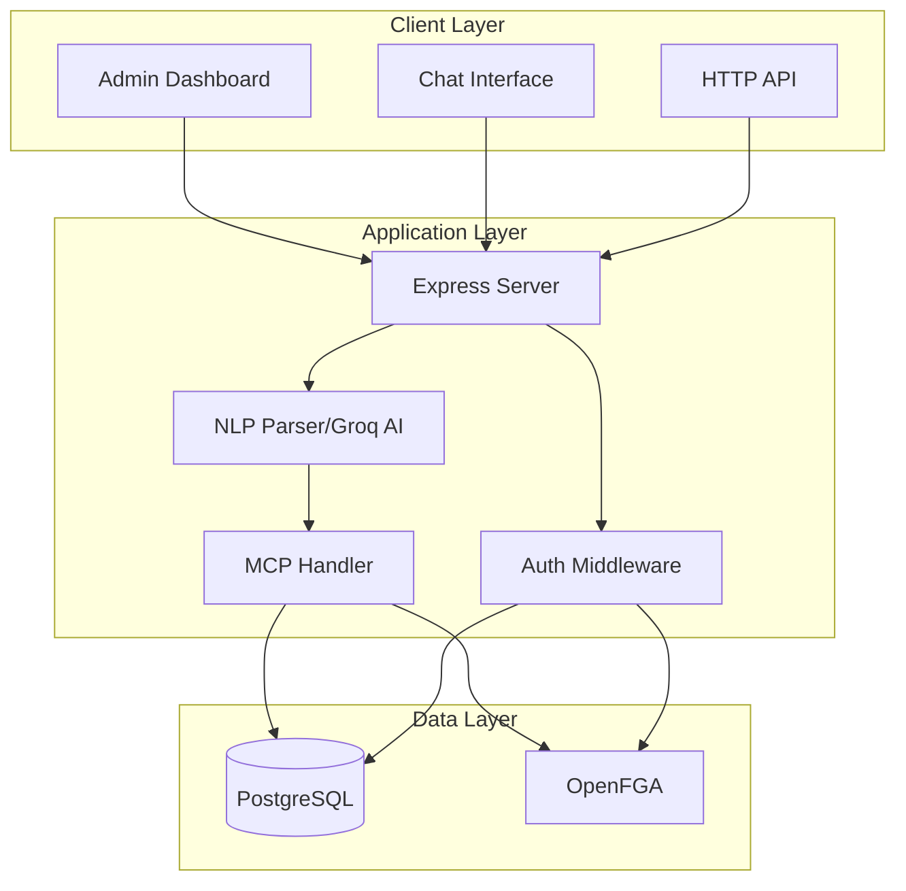

# MCP Resource Manager

A secure, intelligent Resource Management system built with **PostgreSQL**, **OpenFGA**, and **AI-powered natural language processing**. This project demonstrates modern authorization architecture where identity and permissions are completely decoupled from business logic.

## ✨ Features

### 🔐 Fine-Grained Authorization
- **OpenFGA Integration** - Google Zanzibar-inspired authorization
- **Role-Based Access Control** - Owner, Admin, Editor, Viewer roles
- **Group-Based Permissions** - Automatic group membership management
- **Resource-Level Permissions** - Granular access control per resource

### 🤖 AI-Powered Chat Interface
- **Natural Language Commands** - Manage resources using conversational AI
- **Groq AI Integration** - Fast, intelligent intent parsing
- **Pattern Matching Fallback** - Works without AI when needed
- **Conversation Memory** - Context-aware multi-turn conversations

### 👥 User Management
- Create, update, and delete users
- Role assignment and management
- Automatic OpenFGA tuple management
- Password hashing with bcrypt

### 📁 Resource Management
- Create and manage resources across multiple categories
- File-level permission control
- Category-based organization
- Owner-based access by default

### 🎨 Multiple Interfaces
- **HTTP REST API** - Traditional API endpoints
- **Chat Interface** - AI-powered conversational management
- **Admin Dashboard** - Web-based administration panel

## 🏗️ Architecture



### Core Components

- **PostgreSQL** - Stores users and resources (the "what" and "who")
- **OpenFGA** - Manages permissions and relationships (the "who can do what")
- **MCP Handler** - Orchestrates business logic and authorization checks
- **Groq AI** - Parses natural language into structured commands
- **Express Server** - Multi-adapter interface (HTTP, Chat, Admin UI)

See [ARCHITECTURE.md](ARCHITECTURE.md) for detailed architecture documentation.

## 🚀 Quick Start

### Prerequisites

- Node.js 18+ and npm
- PostgreSQL 14+
- OpenFGA server running locally or remotely

### Installation

1. **Clone the repository**
   ```bash
   git clone <repository-url>
   cd MCP-Resource-Manager
   ```

2. **Install dependencies**
   ```bash
   npm install
   ```

3. **Set up PostgreSQL database**
   ```bash
   createdb mcp_resources
   ```

4. **Configure environment variables**
   ```bash
   cp .env.example .env
   ```
   
   Edit `.env` with your configuration:
   ```env
   # OpenFGA Configuration
   FGA_API_URL=http://localhost:8080
   FGA_STORE_ID=your-store-id-here
   FGA_MODEL_ID=your-model-id-here
   
   # Database
   DB_HOST=localhost
   DB_PORT=5432
   DB_NAME=mcp_resources
   DB_USER=postgres
   DB_PASSWORD=your-password
   
   # Groq AI (Optional - for AI-powered chat)
   GROQ_API_KEY=your-groq-api-key
   ```

5. **Set up OpenFGA**
   
   If you don't have OpenFGA running:
   ```bash
   # Using the included binary (Windows)
   .\fga.exe run
   
   # Or using Docker
   docker run -p 8080:8080 openfga/openfga run
   ```

6. **Create OpenFGA store and upload model**
   ```bash
   # Create store
   curl -X POST http://localhost:8080/stores \
     -H "Content-Type: application/json" \
     -d '{"name": "MCP Resource Manager"}'
   
   # Upload authorization model (use the store ID from above)
   curl -X POST http://localhost:8080/stores/{STORE_ID}/authorization-models \
     -H "Content-Type: application/json" \
     -d @model.fga
   ```

7. **Build and run**
   ```bash
   npm run build
   npm start
   
   # Or for development with auto-rebuild
   npm run dev
   ```

8. **Access the application**
   - Admin Dashboard: http://localhost:3001/admin.html
   - Chat Interface: http://localhost:3001/
   - API: http://localhost:3001/api

## 📖 Usage

### HTTP API

#### Authentication
```bash
# Login
curl -X POST http://localhost:3001/api/auth/login \
  -H "Content-Type: application/json" \
  -d '{"username": "admin", "password": "admin123"}'
```

#### User Management
```bash
# List users
curl http://localhost:3001/api/admin/users

# Create user
curl -X POST http://localhost:3001/api/admin/users \
  -H "Content-Type: application/json" \
  -d '{
    "userId": "user123",
    "username": "john",
    "email": "john@example.com",
    "role": "editor"
  }'

# Delete user
curl -X DELETE http://localhost:3001/api/admin/users/john
```

#### Resource Management
```bash
# List resources
curl http://localhost:3001/api/resources

# Create resource
curl -X POST http://localhost:3001/api/resources \
  -H "Content-Type: application/json" \
  -d '{
    "name": "project-plan.pdf",
    "type": "file",
    "category": "Documents"
  }'
```

### Chat Interface

The AI-powered chat interface supports natural language commands:

```
User: "create user alice with email alice@example.com as editor"
Assistant: ✅ User alice created with editor permissions

User: "who am i"
Assistant: You are admin (Role: admin)

User: "make alice an admin"
Assistant: ✅ alice is now an admin

User: "who has access to project-plan.pdf"
Assistant: The following users have access:
- admin (owner)
- alice (editor)

User: "delete user alice"
Assistant: ✅ User alice deleted successfully
```

### Admin Dashboard

Access the web-based admin dashboard at `http://localhost:3001/admin.html` to:
- View and manage all users
- Create new users with role assignment
- Change user roles
- Delete users
- Monitor system activity

## 🔧 Configuration

### Environment Variables

| Variable | Description | Default |
|----------|-------------|---------|
| `FGA_API_URL` | OpenFGA server URL | `http://localhost:8080` |
| `FGA_STORE_ID` | OpenFGA store ID | Required |
| `FGA_MODEL_ID` | OpenFGA model ID | Optional (uses latest) |
| `PORT` | Server port | `3001` |
| `DB_HOST` | PostgreSQL host | `localhost` |
| `DB_PORT` | PostgreSQL port | `5432` |
| `DB_NAME` | Database name | `mcp_resources` |
| `DB_USER` | Database user | `postgres` |
| `DB_PASSWORD` | Database password | Required |
| `GROQ_API_KEY` | Groq AI API key | Optional (enables AI) |

### OpenFGA Model

The authorization model is defined in `model.fga`:

```
model
  schema 1.1

type user

type group
  relations
    define member: [user]

type resource
  relations
    define owner: [user]
    define editor: [user, group#member] or owner
    define viewer: [user, group#member] or editor or owner
    define can_view: viewer
    define can_edit: editor
    define can_delete: owner
```

## 🛠️ Development

### Project Structure

```
MCP-Resource-Manager/
├── src/
│   ├── server.ts           # Main Express server
│   ├── mcp-handler.ts      # MCP protocol handler
│   ├── database.ts         # PostgreSQL operations
│   ├── auth/               # Authentication & authorization
│   ├── chat/               # Chat interface logic
│   └── middleware/         # Express middleware
├── public/                 # Static web files
│   ├── admin.html         # Admin dashboard
│   ├── index.html         # Chat interface
│   └── login.html         # Login page
├── database/
│   └── migrations/        # Database migrations
├── scripts/               # Utility scripts
├── model.fga             # OpenFGA authorization model
└── tests.fga.yaml        # OpenFGA model tests
```

### Running Tests

```bash
# Run TypeScript compilation
npm run build

# Run OpenFGA model tests
fga model test --tests tests.fga.yaml
```

### Database Schema

**Users Table:**
```sql
CREATE TABLE users (
    uuid UUID PRIMARY KEY DEFAULT gen_random_uuid(),
    username VARCHAR(255) UNIQUE NOT NULL,
    email VARCHAR(255) UNIQUE NOT NULL,
    password_hash VARCHAR(255) NOT NULL,
    role VARCHAR(50) NOT NULL,
    created_at TIMESTAMP DEFAULT CURRENT_TIMESTAMP
);
```

**Resources Table:**
```sql
CREATE TABLE resources (
    id SERIAL PRIMARY KEY,
    name VARCHAR(255) NOT NULL,
    type VARCHAR(100) NOT NULL,
    category VARCHAR(100) NOT NULL,
    owner_id UUID REFERENCES users(uuid) ON DELETE CASCADE,
    created_at TIMESTAMP DEFAULT CURRENT_TIMESTAMP
);
```

## 🤝 Contributing

Contributions are welcome! Please feel free to submit a Pull Request.

1. Fork the repository
2. Create your feature branch (`git checkout -b feature/AmazingFeature`)
3. Commit your changes (`git commit -m 'Add some AmazingFeature'`)
4. Push to the branch (`git push origin feature/AmazingFeature`)
5. Open a Pull Request

## 📝 License

This project is licensed under the Apache License 2.0 - see the [LICENSE](LICENSE) file for details.

## 🙏 Acknowledgments

- [OpenFGA](https://openfga.dev) - Fine-grained authorization system
- [Groq](https://groq.com) - Fast AI inference
- [Google Zanzibar](https://research.google/pubs/pub48190/) - Authorization model inspiration

## 📚 Additional Resources

- [ARCHITECTURE.md](ARCHITECTURE.md) - Detailed architecture documentation
- [CHANGELOG.md](CHANGELOG.md) - Version history and changes
- [OpenFGA Documentation](https://openfga.dev/docs)
- [Model Context Protocol](https://modelcontextprotocol.io)

---

**Built using PostgreSQL, OpenFGA, and AI**
